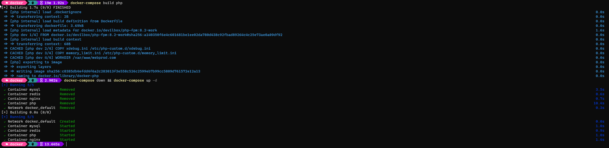
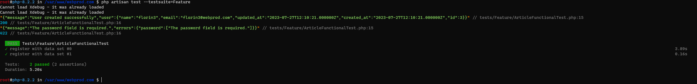
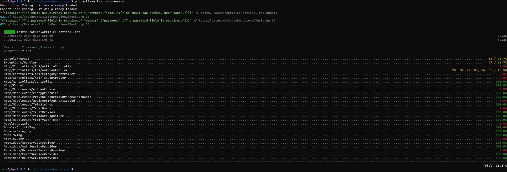

## add the following host to your environment
```
127.0.0.1   webprod.com 
```

## run the containers from within ```/docker``` directory
```bash
docker-compose up -d
```


## add `http://webprod.com:83` to `{{HOST}}` variable in postman
## make sure you have a user in db before login

## enter inside of container
`docker exec -it php bash`

## run tests


## check test coverage

